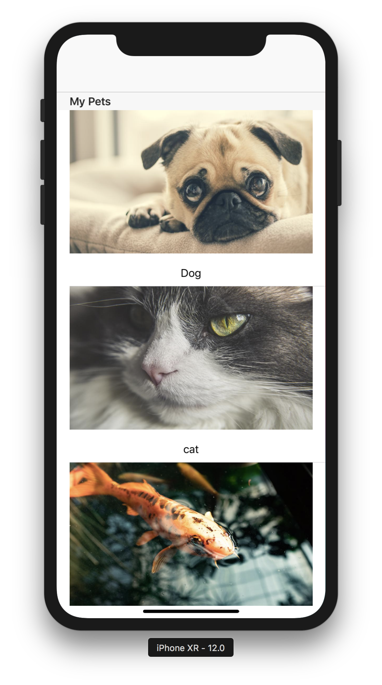

# lighthouseLabs-w3d2-Erin

### Start Project
<b>My-Pet-App-Start</b>

- The 'start' project is the initial repo you should use to follow along with the live demo

### Completed Project
<b>My-Pet-App-Completed</b>

- The 'completed' project is the completed code to refer to if you run into any issues

<b>Screenshot</b>

